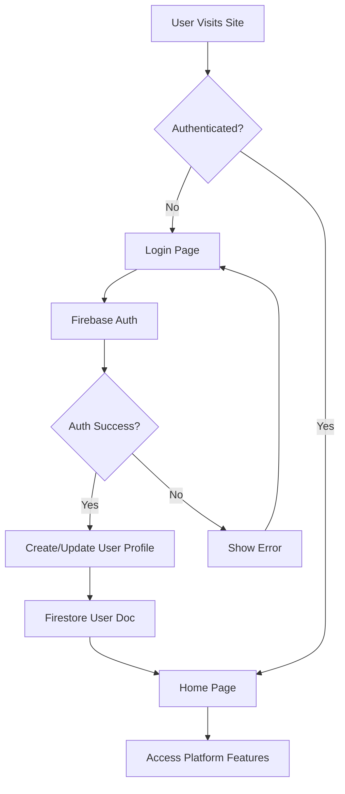

# 🧠 NeuroHub - Neurodiversity Support & Learning Platform

<div align="center">


**An inclusive platform designed to support neurodiverse individuals through interactive learning, therapeutic games, and community engagement.**

[🚀 Features](#-features) • [🏗️ Architecture](#️-architecture) • [📦 Installation](#-installation) • [🔧 Usage](#-usage) • [🤝 Contributing](#-contributing)

</div>

---

## 📋 Table of Contents

- [Overview](#-overview)
- [Features](#-features)
- [Technology Stack](#-technology-stack)
- [Architecture](#️-architecture)
- [System Workflow](#-system-workflow)
- [Project Structure](#-project-structure)
- [Installation](#-installation)
- [Configuration](#-configuration)
- [Usage](#-usage)
- [API Reference](#-api-reference)
- [Deployment](#-deployment)
- [Contributing](#-contributing)
- [License](#-license)

---

## 🌟 Overview

**NeuroHub** is a comprehensive web platform designed to support individuals with neurodiversity conditions including ADHD, Autism, Dyslexia, OCD, Bipolar Disorder, and more. The platform combines:

- **📚 Interactive Learning Modules** - Structured courses on neurodiversity topics
- **🎮 Therapeutic Games** - Cognitive training and skill-building games
- **💬 Community Features** - Real-time chat and support forums
- **📊 Progress Tracking** - Personalized assessments and analytics
- **🔊 Accessibility Tools** - Speech recognition and text-to-speech integration

### Mission
To create an inclusive digital ecosystem that empowers neurodiverse individuals through education, engagement, and community support.

---

## ✨ Features

### 🎓 Learning & Education
- **13+ Curated Courses** covering various neurodiversity topics
- Progress tracking with visual indicators
- Course difficulty levels: Beginner, Intermediate, Advanced
- Interactive quizzes and assessments
- Multi-media learning resources

### 🎮 Therapeutic Games
- **Memory Match** - Cognitive memory enhancement
- **Word Puzzle** - Vocabulary and language skills
- **Speed Reading** - Reading comprehension training
- **Pattern Recognition** - Visual-spatial processing
- **Emotion Matching** - Social-emotional learning
- **Focus Trainer** - Attention and concentration
- **Hand Draw Game** - Fine motor skills (with hand tracking)
- **Auditory Guessing** - Auditory processing
- **Social Interaction** - Communication skills

### 🔐 Authentication & User Management
- Firebase Authentication (Email/Password, Social Login)
- User profiles with customizable settings
- Progress persistence across sessions
- Secure data handling

### 💬 Community & Communication
- Real-time chatbot assistance
- Community forums
- Blog and articles section
- Job board for neurodiverse individuals

### ♿ Accessibility Features
- Speech recognition integration
- Text-to-speech capabilities
- Voice commands
- Theme customization (light/dark mode)
- Responsive design for all devices

### 📊 Analytics & Tracking
- User progress tracking
- Course completion statistics
- Game performance metrics
- Daily activity logs

---

## 🛠️ Technology Stack

### **Frontend**
| Technology | Version | Purpose |
|------------|---------|---------|
| React | 18.3.1 | UI Framework |
| TypeScript | 4.9.5 | Type Safety |
| Vite | 5.4.2 | Build Tool & Dev Server |
| React Router | 6.30.0 | Client-side Routing |
| Tailwind CSS | 3.4.17 | Utility-first Styling |
| Material-UI | 6.4.6 | Component Library |
| Bootstrap | 5.3.3 | Additional UI Components |
| Framer Motion | 11.18.2 | Animations |

### **Backend & Cloud Services**
| Service | Purpose |
|---------|---------|
| Firebase Authentication | User authentication & authorization |
| Firestore | NoSQL database for user data |
| Firebase Storage | File storage (images, media) |
| Firebase Functions | Serverless backend logic |
| Firebase Data Connect | GraphQL API layer |
| Firebase Hosting | Static site hosting |

### **Specialized Libraries**
| Library | Purpose |
|---------|---------|
| Three.js (0.173.0) | 3D graphics rendering |
| Vanta.js (0.5.24) | Animated backgrounds |
| Socket.io (4.8.1) | Real-time communication |
| ML Random Forest (2.1.0) | Machine learning features |
| React Speech Recognition (3.10.0) | Voice input |
| Lottie React (2.4.1) | Animation playback |

### **Development Tools**
- ESLint - Code linting
- PostCSS + Autoprefixer - CSS processing
- TypeScript ESLint - TypeScript linting
- Git - Version control

### **Python Components**
- Hand tracking algorithms (`handdraw.py`)
- Game backend logic (`scoopd.py`)
- Flask server (`server.py`)

---

## 🏗️ Architecture

### **System Architecture Diagram**

```
┌─────────────────────────────────────────────────────────────────┐
│                         CLIENT LAYER                             │
├─────────────────────────────────────────────────────────────────┤
│  ┌──────────────┐  ┌──────────────┐  ┌──────────────┐          │
│  │   React UI   │  │  TypeScript  │  │  Tailwind    │          │
│  │  Components  │  │    Logic     │  │     CSS      │          │
│  └──────────────┘  └──────────────┘  └──────────────┘          │
│                                                                   │
│  ┌──────────────────────────────────────────────────────┐       │
│  │            React Router (Client Routing)             │       │
│  └──────────────────────────────────────────────────────┘       │
└─────────────────────────────────────────────────────────────────┘
                              ▼
┌─────────────────────────────────────────────────────────────────┐
│                      STATE MANAGEMENT                            │
├─────────────────────────────────────────────────────────────────┤
│  ┌──────────────┐  ┌──────────────┐  ┌──────────────┐          │
│  │   Context    │  │   Local      │  │   Session    │          │
│  │     API      │  │   Storage    │  │   Storage    │          │
│  └──────────────┘  └──────────────┘  └──────────────┘          │
└─────────────────────────────────────────────────────────────────┘
                              ▼
┌─────────────────────────────────────────────────────────────────┐
│                    COMMUNICATION LAYER                           │
├─────────────────────────────────────────────────────────────────┤
│  ┌──────────────┐  ┌──────────────┐  ┌──────────────┐          │
│  │  Firebase    │  │  Socket.io   │  │   GraphQL    │          │
│  │     SDK      │  │   Client     │  │  (DataConn)  │          │
│  └──────────────┘  └──────────────┘  └──────────────┘          │
└─────────────────────────────────────────────────────────────────┘
                              ▼
┌─────────────────────────────────────────────────────────────────┐
│                      BACKEND SERVICES                            │
├─────────────────────────────────────────────────────────────────┤
│  ┌────────────────────────────────────────────────────┐         │
│  │              Firebase Services                      │         │
│  │  ┌──────────┐ ┌──────────┐ ┌──────────┐           │         │
│  │  │   Auth   │ │ Firestore│ │ Storage  │           │         │
│  │  └──────────┘ └──────────┘ └──────────┘           │         │
│  │  ┌──────────┐ ┌──────────┐ ┌──────────┐           │         │
│  │  │Functions │ │  Hosting │ │DataConn  │           │         │
│  │  └──────────┘ └──────────┘ └──────────┘           │         │
│  └────────────────────────────────────────────────────┘         │
│                                                                   │
│  ┌────────────────────────────────────────────────────┐         │
│  │           Python Backend Services                  │         │
│  │  ┌──────────┐ ┌──────────┐                        │         │
│  │  │  Flask   │ │   ML     │                        │         │
│  │  │  Server  │ │ Services │                        │         │
│  │  └──────────┘ └──────────┘                        │         │
│  └────────────────────────────────────────────────────┘         │
└─────────────────────────────────────────────────────────────────┘
                              ▼
┌─────────────────────────────────────────────────────────────────┐
│                        DATA LAYER                                │
├─────────────────────────────────────────────────────────────────┤
│  ┌──────────────┐  ┌──────────────┐  ┌──────────────┐          │
│  │   Firestore  │  │   Firebase   │  │   GraphQL    │          │
│  │   Database   │  │   Storage    │  │    Schema    │          │
│  └──────────────┘  └──────────────┘  └──────────────┘          │
└─────────────────────────────────────────────────────────────────┘
```

### **Component Architecture**

```
src/
├── App.tsx (Main Application Router)
│
├── components/
│   ├── Navbar.tsx (Navigation & Auth State)
│   ├── Footer.tsx (Site Footer)
│   ├── LogoutButton.tsx
│   ├── Voice.tsx (Speech Features)
│   ├── speach.tsx (TTS Integration)
│   └── games/ (Game Components)
│
├── pages/
│   ├── Home.tsx (Landing Page)
│   ├── Learning.tsx (Course Catalog)
│   ├── Games.tsx (Game Library)
│   ├── Community.tsx (Forums)
│   ├── Profile.tsx (User Dashboard)
│   ├── Assessment.tsx (Testing Module)
│   ├── Login.tsx (Authentication)
│   └── ... (other pages)
│
├── contexts/
│   ├── AuthContext.tsx (Auth State)
│   └── ThemeContext.tsx (Theme State)
│
└── utils/
    ├── handTracking.ts (CV Utils)
    └── themeHelpers.ts (Theme Utils)
```

---

## 🔄 System Workflow

### **1. User Authentication Flow**



### **2. Learning Module Workflow**

```
User Navigation → Course Selection → Course Detail Page
                                          ↓
                              Check User Progress (Firestore)
                                          ↓
                    ┌────────────────────┴────────────────────┐
                    ↓                                         ↓
          Resume from Last Position              Start from Beginning
                    ↓                                         ↓
                Content Delivery (Videos/Text/Quizzes)
                                          ↓
                          Track Progress → Update Firestore
                                          ↓
                          Quiz Assessment (if applicable)
                                          ↓
                      Update Completion Status → Award Badges
```

### **3. Game Interaction Workflow**

```
Game Selection → Load Game Component → Initialize Game State
                                              ↓
                              ┌───────────────┴───────────────┐
                              ↓                               ↓
                    Standard Input Games          Advanced Games (Hand Tracking)
                              ↓                               ↓
                    Click/Keyboard Input          Python CV Backend (WebSocket)
                              ↓                               ↓
                        Game Logic                   Hand Gesture Detection
                              ↓                               ↓
                        Score Tracking ←──────────────────────┘
                              ↓
                    Save Results to Firestore
                              ↓
                    Update User Statistics & Leaderboard
```

### **4. Real-time Chat Workflow**

```
User Opens Chatbot → Establish Socket.io Connection
                              ↓
                    Load Chat History (Firestore)
                              ↓
                User Sends Message (Text/Voice)
                              ↓
                    ┌─────────┴─────────┐
                    ↓                   ↓
            Text Input            Voice Input (Speech Recognition)
                    ↓                   ↓
                    └─────────┬─────────┘
                              ↓
                    Broadcast to Server (Socket.io)
                              ↓
                    AI/Bot Processing (if applicable)
                              ↓
                    Store in Firestore
                              ↓
                    Emit Response to Client
                              ↓
                    Update UI with New Message
```

### **5. Data Persistence Flow**

```
User Action (Course Progress/Game Score/Settings)
                    ↓
            Local State Update (React)
                    ↓
            Debounced Firebase Write
                    ↓
┌───────────────────┼───────────────────┐
↓                   ↓                   ↓
Firestore         Storage            Auth Profile
(User Data)       (Media Files)      (User Info)
```

---

## 📁 Project Structure

```
NUEROHUBLAUNCHED/
│
├── 📄 Configuration Files
│   ├── vite.config.ts           # Vite build configuration
│   ├── tsconfig.json            # TypeScript configuration
│   ├── tailwind.config.js       # Tailwind CSS config
│   ├── postcss.config.js        # PostCSS configuration
│   ├── eslint.config.js         # ESLint rules
│   ├── package.json             # Dependencies & scripts
│   └── firebase.json            # Firebase project config
│
├── 🔥 Firebase Configuration
│   ├── firestore.rules          # Security rules for Firestore
│   ├── firestore.indexes.json   # Database indexes
│   ├── storage.rules            # Storage security rules
│   ├── database.rules.json      # Realtime DB rules
│   ├── apphosting.yaml          # App hosting config
│   └── remoteconfig.template.json
│
├── ⚡ Firebase Functions (Node.js)
│   └── functions/
│       ├── src/
│       │   ├── index.ts         # Main functions entry
│       │   └── genkit-sample.ts # AI/ML functions
│       ├── package.json
│       └── tsconfig.json
│
├── 🔌 Data Connect (GraphQL)
│   └── dataconnect/
│       ├── dataconnect.yaml
│       ├── schema/
│       │   └── schema.gql       # GraphQL schema
│       └── connector/
│           ├── queries.gql      # GraphQL queries
│           └── mutations.gql    # GraphQL mutations
│
├── 🎨 Frontend Application
│   └── src/
│       ├── main.tsx             # App entry point
│       ├── App.tsx              # Main router component
│       ├── index.css            # Global styles
│       │
│       ├── 🧩 components/
│       │   ├── Navbar.tsx
│       │   ├── Footer.tsx
│       │   ├── Voice.tsx        # Voice features
│       │   ├── speach.tsx       # TTS integration
│       │   └── games/           # Game components
│       │       ├── MemoryMatch.tsx
│       │       ├── WordPuzzle.tsx
│       │       ├── SpeedReading.tsx
│       │       ├── PatternRecognition.tsx
│       │       ├── EmotionMatching.tsx
│       │       ├── FocusTrainer.tsx
│       │       ├── HandDrawGame.tsx
│       │       ├── AuditoryGuessing.tsx
│       │       ├── SocialInteraction.tsx
│       │       ├── ScoopedGame.tsx
│       │       ├── handdraw.py   # CV backend
│       │       └── scoopd.py     # Game backend
│       │
│       ├── 📄 pages/
│       │   ├── Home.tsx         # Landing page
│       │   ├── Learning.tsx     # Course catalog
│       │   ├── Games.tsx        # Game library
│       │   ├── Community.tsx    # Forums
│       │   ├── Profile.tsx      # User dashboard
│       │   ├── Assessment.tsx   # Testing
│       │   ├── Quiz.tsx         # Quizzes
│       │   ├── Daily.tsx        # Daily tasks
│       │   ├── Chatbot.tsx      # Chat interface
│       │   ├── Blog.tsx         # Blog posts
│       │   ├── Articles.tsx     # Articles
│       │   ├── Jobs.tsx         # Job board
│       │   ├── About.tsx        # About page
│       │   ├── Settings.tsx     # User settings
│       │   ├── Login.tsx        # Auth page
│       │   ├── AuthContext.tsx  # Auth context
│       │   └── firebase.tsx     # Firebase config
│       │
│       ├── 🌐 contexts/
│       │   └── ThemeContext.tsx # Theme management
│       │
│       └── 🛠️ utils/
│           ├── handTracking.ts  # Hand tracking utilities
│           └── themeHelpers.ts  # Theme utilities
│
├── 🐍 Python Backend
│   └── server.py                # Flask server
│
├── 📦 Generated Code
│   └── dataconnect-generated/   # Auto-generated GraphQL SDK
│
└── 🌐 Static Assets
    └── public/
        └── index.html
```

---

## 🚀 Installation

### **Prerequisites**

- **Node.js** >= 18.x
- **Python** >= 3.8
- **npm** or **yarn**
- **Firebase CLI** (for deployment)
- **Git**

### **Step 1: Clone Repository**

```bash
git clone https://github.com/Sujay149/NueroDiverse.git
cd NUEROHUBLAUNCHED
```

### **Step 2: Install Frontend Dependencies**

```bash
npm install
```

### **Step 3: Install Python Dependencies**

```bash
cd src/components/games
pip install -r requirements.txt  # Create this if needed
# Typical packages: flask, opencv-python, mediapipe, etc.
```

### **Step 4: Install Firebase Functions Dependencies**

```bash
cd functions
npm install
cd ..
```

### **Step 5: Environment Configuration**

Create a `.env` file in the root directory:

```env
# Firebase Configuration
VITE_FIREBASE_API_KEY=your_api_key
VITE_FIREBASE_AUTH_DOMAIN=your_auth_domain
VITE_FIREBASE_PROJECT_ID=your_project_id
VITE_FIREBASE_STORAGE_BUCKET=your_storage_bucket
VITE_FIREBASE_MESSAGING_SENDER_ID=your_sender_id
VITE_FIREBASE_APP_ID=your_app_id

# Optional: Additional Services
VITE_SOCKET_URL=http://localhost:5000
VITE_PYTHON_BACKEND_URL=http://localhost:8000
```

---

## ⚙️ Configuration

### **Firebase Setup**

1. **Create Firebase Project**
   - Go to [Firebase Console](https://console.firebase.google.com/)
   - Create a new project
   - Enable Authentication, Firestore, Storage, Functions

2. **Configure Firebase Locally**

```bash
firebase login
firebase init
# Select: Firestore, Functions, Hosting, Storage
```

3. **Update Firebase Config**
   - Copy config from Firebase Console
   - Update `src/pages/firebase.tsx`

### **Firestore Security Rules**

```javascript
rules_version = '2';
service cloud.firestore {
  match /databases/{database}/documents {
    match /users/{userId} {
      allow read, write: if request.auth != null && request.auth.uid == userId;
    }
    match /courses/{courseId} {
      allow read: if true;
      allow write: if request.auth != null;
    }
    // Add more rules as needed
  }
}
```

---

## 🔧 Usage

### **Development Mode**

```bash
# Start Frontend (Vite Dev Server)
npm run dev
# Access at http://localhost:3000

# Start Python Backend (if needed)
python server.py
# Runs on http://localhost:8000

# Start Firebase Emulators
firebase emulators:start
```

### **Build for Production**

```bash
# Build frontend
npm run build

# Test production build locally
npm run preview
```

### **Run Linting**

```bash
npm run lint
```

---

## 🌐 API Reference

### **Firebase Data Connect (GraphQL)**

**Queries:**
- Located in `dataconnect/connector/queries.gql`
- Auto-generated SDK in `dataconnect-generated/`

**Mutations:**
- Located in `dataconnect/connector/mutations.gql`

**Usage Example:**

```typescript
import { getConnectorClient } from '@firebasegen/default-connector';

const client = getConnectorClient();
// Use generated queries and mutations
```

### **Firebase Functions**

Functions are defined in `functions/src/index.ts`

### **Python Backend API**

```python
# server.py endpoints
POST /hand-tracking - Hand gesture detection
POST /game-logic - Game backend processing
```

---

## 🚀 Deployment

### **Deploy to Firebase Hosting**

```bash
# Build the app
npm run build

# Deploy everything
firebase deploy

# Deploy specific services
firebase deploy --only hosting
firebase deploy --only functions
firebase deploy --only firestore:rules
```

### **Environment Variables for Production**

Set production environment variables in Firebase Console:
- Functions Configuration
- App Hosting environment variables

---

## 📊 Key Features in Detail

### **Accessibility Implementation**

1. **Speech Recognition**
   ```typescript
   import SpeechRecognition from 'react-speech-recognition';
   // Voice command integration throughout app
   ```

2. **Text-to-Speech**
   ```typescript
   import { SpeechText } from './components/speach';
   // Read-aloud functionality for all content
   ```

3. **Theme Customization**
   - Light/Dark mode toggle
   - High contrast options
   - Font size adjustments

### **Real-time Features**

- **Socket.io Integration**: Real-time chat and notifications
- **Live Updates**: Firestore real-time listeners for data sync

### **Machine Learning Integration**

- `ml-random-forest`: Used for personalized recommendations
- Hand tracking with MediaPipe (Python backend)

---

## 🧪 Testing

```bash
# Run tests (if configured)
npm test

# Firebase emulator testing
firebase emulators:exec "npm test"
```

---

## 🤝 Contributing

Contributions are welcome! Please follow these steps:

1. Fork the repository
2. Create a feature branch (`git checkout -b feature/AmazingFeature`)
3. Commit your changes (`git commit -m 'Add some AmazingFeature'`)
4. Push to the branch (`git push origin feature/AmazingFeature`)
5. Open a Pull Request

### **Code Style Guidelines**

- Follow ESLint configuration
- Use TypeScript for type safety
- Write meaningful commit messages
- Add comments for complex logic

---

## 📝 License

This project is licensed under the **ISC License**.

---

## 👥 Authors & Acknowledgments

- **Sujay** - Initial work - [Sujay149](https://github.com/Sujay149)

### **Built With**
- ❤️ React & TypeScript
- 🔥 Firebase Platform
- 🎨 Tailwind CSS & Material-UI
- 🧠 Focus on neurodiversity inclusion

---

## 📞 Support & Contact

- **Issues**: [GitHub Issues](https://github.com/Sujay149/NueroDiverse/issues)
- **Email**: Contact through GitHub profile
- **Documentation**: See `/docs` folder (if available)

---

## 🗺️ Roadmap

- [ ] Mobile app (React Native)
- [ ] Advanced AI chatbot
- [ ] Multi-language support
- [ ] Offline mode
- [ ] Parent/caregiver dashboard
- [ ] Professional assessment tools
- [ ] Integration with healthcare providers

---

<div align="center">

**Made with 🧠 and 💙 for the neurodivergent community**

⭐ Star this repo if you find it helpful!

</div>